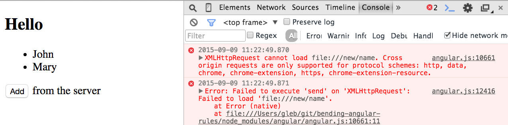

# bending-angular-rules

## Tags

* `step-0` - the initial static HTML5 boilerplate with a list of names
* `step-1` - simple Angular application showing a list of names
* `step-2` - adding the entered new name
* `step-3` - dynamically extend a method on the scope
* `step-4` - calling the server to get the new name
* `step-5` - mocking server responses using closure loophole
* `step-6` - loading Angular app from Node
* `step-7` - unit testing private function using code extraction

## Start

Create a static page with HTML5 boilerplate code that shows a list of names
to greet, something like this (saved as `index.html`)

    <!DOCTYPE html>
    <html>
    <head>
      <title>hello world</title>
    </head>
    <body>
      <h2>Hello</h2>
      <ul>
        <li>John</li>
        <li>Mary</li>
      </ul>
    </body>
    </html>

You can view this page by opening the file in any browser (I used Chrome in this demo) 
directly from the command line

    open index.html


## Showing list of names: step-1

Let us allow the user to enter new names to be greeted. We will need to add an input text field
and a button. We can add them to our static markup for now

    <!DOCTYPE html>
    <html>
    <head>
      <title>hello world</title>
    </head>
    <body>
      <h2>Hello</h2>
      <ul>
        <li>John</li>
        <li>Mary</li>
      </ul>
      Enter a name <input type="text" /><button>Add</button>
    </body>
    </html>

Let us make this application live by adding a dash of Angular framework

    npm install angular

Add Angular controller to the page, it will be injected a special object `$scope` to hold
the list of names

    <!DOCTYPE html>
    <html>
    <head>
      <title>hello world</title>
      <script src="node_modules/angular/angular.js"></script>
      <script>
      angular.module('HelloApp', [])
        .controller('HelloController', function ($scope) {
          $scope.names = ['John', 'Mary'];
        });
      </script>
    </head>
    <body ng-app="HelloApp" ng-controller="HelloController">
      <h2>Hello</h2>
      <ul>
        <li ng-repeat="name in names track by $index">{{ name }}</li>
      </ul>
      Enter a name <input type="text" /><button>Add</button>
    </body>
    </html>

You need `track by $index` if you want to allow duplicate names in the list.
We can control the list of names to be shown from the outside. From the browser's console type

    angular.element(document.body).scope().names
    // ["John", "Mary"]
    angular.element(document.body).scope().names.push('Dave')
    angular.element(document.body).scope().$apply();
    // the list is reflected in the DOM


We can access the scope of any DOM element (or surrounding it) via `element.scope()` method.
Since the `$scope` is simply a plain object, to let Angular know we have modified it and would
like to see the changes, we need to call `scope.$apply()` method.

## Add entered name to the list: step-2

Let us connect our static input field and the button to the list of names.
We can change the HTML markup to bind the input value to the property `newName` on the `$scope`

    Enter a name <input type="text" ng-model="newName" />

And we can call a method on the `$scope` (see the pattern) whenever the user clicks the button

    <button ng-click="addName()">Add</button>

We need to write the `addName()` method, otherwise nothing is happening.

```js
.controller('HelloController', function ($scope) {
  $scope.names = ['John', 'Mary'];
  $scope.addName = function () {
    $scope.names.push($scope.newName);
  };
});
```

Nice! The `newName` property was created implicitly by the input field bound to the model property `newName`.
Since we are using built-in click handler `ng-click`, we did not have to call `$scope.$apply()` - it is done
automatically for us.

## Clear the entered value: step-3

We notice that the added name is NOT cleared from the input field. 


We never set the scope
property to the `undefined` or an empty string, thus it just stayed in the DOM. While it would be simple
to write the following code, we want to experiment first

```js
$scope.addName = function () {
  $scope.names.push($scope.newName);
  delete $scope.newName;
};
```

Can we *add* the missing delete line to the scope method dynamically?
Yes we can, right from the browser's console

```js
var scope = angular.element(document.body).scope();
var _addName = scope.addName; // save reference to the true method
scope.addName = function () { _addName(); delete scope.newName; };
```


BOOM! We dynamically extended an Angular application! This is a very useful approach:
accessing methods from the `$scope` to wrap them on the fly. For example, we can monitor
the method's execution. From the Chrome console:

    monitor(scope.addName);
    // Click "Add" button
    // VM946:1 function scope.addName called

We can even find where the code is without knowing it. Let us say, we want to stop when the 
button is clicked and we get into the `addName` method

    debug(angular.element(document.body).scope().addName)
    // Click "Add" button
    // Debugger pauses at the first line in `addName`


We can even profile long-running methods using Chrome's DevTools by "wrapping" the method
in `console.profile()` and `console.profileEnd()` commands. 
See [Improving Angular web app performance example][code-snippets-post] for details.

[code-snippets-post]: http://glebbahmutov.com/blog/improving-angular-web-app-performance-example/

## Calling the server to get the new name: step-4

Let us show how we can bend JavaScript closure rules a little. We can get a reference to the 
`$scope` object and the $scope.addName`, thus we can override the method completely at run-time

```js
var scope = angular.element(document.body).scope();
scope.addName = function () { alert('Not adding ' + scope.newName); };
```

This is a complete replacement. What if we wanted to do something else - like partial replacement?
Here is a good example. Let us say, `$scope.addName` grabbed the name not from the input field, but
from a server.

```html
<button ng-click="addName()">Add</button> from the server
```

```js
.controller('HelloController', function ($scope, $http) {
  $scope.names = ['John', 'Mary'];
  $scope.addName = function () {
    $http.get('/new/name').then(function (newName) {
      $scope.names.push(newName);
    });
  };
});
```

Well, we are running straight from the file system using `open index.html`. When we click "Add"
button we get an Ajax error

    Error: Failed to execute 'send' on 'XMLHttpRequest': Failed to load 'file:///new/name'



Duh! We don't have a server to respond.

## Bending the rules to mock the server response: step-5

Let us bend the JavaScript closure rules to mock the server. Here is how we are going to 
overwrite the `addName` method at runtime from the browser's console *to fake* the `$http` service.

```js
var $http = { 
    get: function (url) { 
        return new Promise(function (resolve) { 
            return resolve('Mock name'); 
        });
    } 
};
var $scope = angular.element(document.body).scope();
var _addName = $scope.addName;
$scope.addName = eval('(' + _addName.toString() + ')');
```

Click the "Add" button.


BOOM! The mock promise-returning function from the browser's console 
*overwrote a variable inside the parent's closure of a $scope method*. 
We knew that `addName` is using `$http` and `$scope` variables. Thus we replaced
the function by evaluating the `$scope.addName` method *as is*, but with *our defined*
variables; `$scope` was the same, but `$http` was a fake one. The JavaScript `eval`
takes the *current* scope as the parent scope, thus we can substitute new functionality
into the existing application dynamically.

Really useful library based on this principle is [ng-wedge][ng-wedge], it is a
mock response utility for a live application.

[ng-wedge]: https://github.com/bahmutov/ng-wedge

## Why can't we load Angular app directly from NodeJS? step-6

We have installed the AngularJS library using *Node Package Manager*

    npm install angular

Yet, if we move the application's code into a separate javascript file, we
cannot load it directly. Try moving the JavaScript into a separate file

```js
// app.js
angular.module('HelloApp', [])
  .controller('HelloController', function ($scope, $http) {
    $scope.names = ['John', 'Mary'];
    $scope.addName = function () {
      $http.get('/new/name').then(function (newName) {
        $scope.names.push(newName);
      });
    };
  });
```
    $ node app.js 
    /git/bending-angular-rules/app.js:1
    (function (exports, require, module, __filename, __dirname) { angular.module('
                                                                  ^
    ReferenceError: angular is not defined

Of course, we loaded Angular framework first in our HTML page, before loading the `app.js` file.

    // index.html
    <script src="node_modules/angular/angular.js"></script>
    <script src="app.js"></script>

Can we load AngularJS framework itself directly from Node? Not directly

    $ node node_modules/angular/angular.js
    /git/bending-angular-rules/node_modules/angular/angular.js:28686
    })(window, document);
       ^
    ReferenceError: window is not defined

It would be very cool if we could load Angular without `window`. 
While this is [possible][Run Angular in Web Worker], I prefer a different approach to this problem. 
We will *simulate the full browser environment (window, document)*
under NodeJS. We can do this using [benv][benv] module that puts a very simple API on top of
[jsdom][jsdom].

    npm install benv

Let us create a file that shows loading AngularJS framework and `app.js` from Node

```js
// load.js
var benv = require('benv');
benv.setup(function () {
  benv.expose({
    angular: benv.require('node_modules/angular/angular.js', 'angular')
  });
  console.log('window is', typeof window);
  console.log('document is', typeof document);
  console.log('angular is', typeof angular);
  console.log('window.angular === angular', window.angular === angular);
});
```

You can now execute this file `load.js` from Node to verify that the synthetic environment has been
setup and the Angular framework has been loaded.

    $ node load.js 
    window is object
    document is object
    angular is object
    window.angular === angular true

Instead of printing diagnostic messages, let us load our Angular application. We can now use
simple CommonJS require included with Node for this

```js
// load.js
var benv = require('benv');
benv.setup(function () {
  benv.expose({
    angular: benv.require('node_modules/angular/angular.js', 'angular')
  });
  require('./app');
  // confirm that module HelloApp has controller HelloController
  var $controller = angular.injector(['ng', 'HelloApp']).get('$controller');
  var scope = {};
  $controller('HelloController', { $scope: scope });
  console.log(scope.names);
  // prints [ 'John', 'Mary' ]
});
```


Nice, we are instantiating parts of Angular app directly from the command line using Node without
using any browsers. 

[Run Angular in Web Worker]: http://glebbahmutov.com/blog/run-angular-in-web-worker/
[benv]: https://npmjs.org/package/benv
[jsdom]: https://npmjs.org/package/jsdom

## Why NodeJS require matters: step-7

Why did we spend time loading the Angular code under Node? Why is Node's built-in `require` 
anything but the ordinary implementation of the CommonJS standard? Turns out it has nifty features
we can exploit.

* It has a *preprocessor hook* that can run the loaded source through user-supplied callback function
before evaluating it.
* The built-in `require` method can be *overwritten completely* using the same closure trick we have
seen before, see [Hacking Node require][hacking require]

[hacking require]: http://glebbahmutov.com/blog/hacking-node-require/

Both of these features were used to implement [really-need][really-need] - a replacement for NodeJS `require`
method. Some of the cool features it can do: rewrite the loaded source, bust module cache, rebuild the compiled
exported values, pass arguments to the module and mock `__dirname` and `__filename`. 

```js
require = require('really-need');
var foo = require('./foo', {
    // remove previously loaded foo module
    bustCache: true,
    // remove from cache AFTER loading
    keep: false,
    pre: function (source, filename) {
        // transform the source before compiling it
        return source;
    },
    post: function (exported, filename) {
        // transform the exported object / value from the file
        return exported;
    },
    // inject additional values into foo.js
    args: {
        a: 10,
        b: 5,
        __dirname: '/some/path'
    }
});
```

The `pre` hook is especially useful for source rewriting. 
We could use it to instrument the source code with code coverage statements.
Or we could use it to "grab" references to private functions. Why would one need to do this?
To enable quick unit testing of *private functions, expressions and variables*. For example
if we had file `foo.js` that exports nothing, we could run the source through a preprocessor
whenever someone required it.

```js
// foo.js
var foo = 'foo';
```

and the evaluated source code would be something like

```js
// transformed code from foo.js
var foo = 'foo';
global.__references['foo'] = foo;
```

Imagine the new name to be added to the list comes from a private function inside the file `app.js`.

```js
// app.js
(function () {
  function nextName() {
    return 'World';
  }
  angular.module('HelloApp', [])
    .controller('HelloController', function ($scope) {
      $scope.names = ['John', 'Mary'];
      $scope.addName = function () {
        $scope.names.push(nextName());
      };
    });
}());
```

It certainly works - we can see the effect even from the command line


Can we unit test the function `nextName` to see how it behaves? Only indirectly by constructing a controller,
adding a mock scope object, calling `addName`, etc. Such a long process. Or we could use a hook into NodeJS
loader using `really-need` that can grab a reference to any function for us. All we need to tell the loader
is the signature of the function we need. We have implemented the Angular initialization (using `benv`
and NodeJS hook) in a single helper module [ng-dice][ng-dice]

    npm install ng-dice

`ng-dice` stands for A**ng**ular **D**ependency **I**njection and **C**ode **E**xtraction library.

Create a simple BDD unit test for Mocha or Jasmine test framework

```js
// next-name-spec.js
var ngDice = require('ng-dice');
ngDice({
  name: 'app',
  file: __dirname + '/app.js',
  extract: 'nextName()',
  tests: function (codeExtract) {
    it('returns next name', function () {
      var nextName = codeExtract();
      console.assert(nextName() === 'World');
    });
  }
});
```

We can confirm that the unit test passes

    $ mocha next-name-spec.js 
      app
        nextName()
          ✓ returns next name 
      1 passing (87ms)

Here is what the unit test has accomplished

* Loaded the CommonJS module `next-name-spec.js`
* The `ngDice` function has loaded the AngularJS library from `node_modules` path
* It then loaded using a patched NodeJS `require` method file `app.js`, rewriting the source
to insert code to grab the reference to a function with the signature `nextName()`
* The Angular application code loaded fine using the synthetic browser environment
* When we called the `codeExtract()` function passed back to our user code, we got the
reference to the actual `function nextName()` from `app.js`
* We called `nextName()` directly and confirmed its output.

One can argue that unit testing private functions and variables goes against the principles
of black box testing. Yes, but it pays to bend the rules a little.

[really-need]:  https://npmjs.org/package/really-need
[ng-dice]:  https://npmjs.org/package/ng-dice
